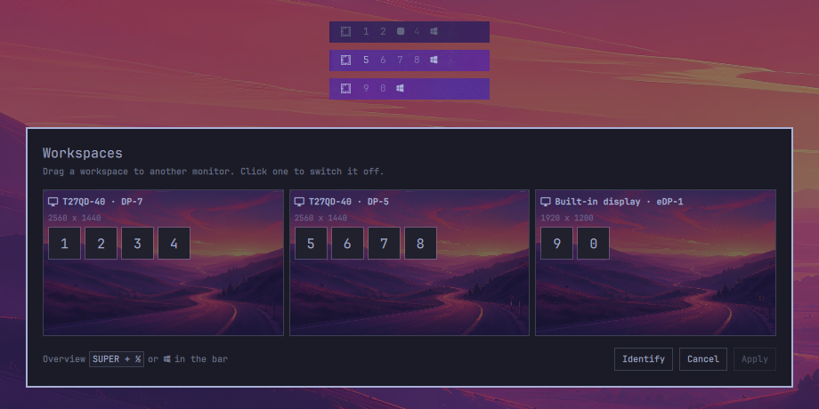

# Workspaces per Monitor

Pin Hyprland workspaces to specific monitors, and make each monitor's bar show
only the workspaces that monitor owns.



- **Plugin ID:** `io.github.kimm-stensborg.workspaces`
- **Kinds:** `bar-widget`, `overlay`, `service`
- **License:** MIT
- **Requires:** Omarchy 4 (Quattro) with `omarchy-shell`, and Hyprland's Lua config

## Dependencies

All ship with Omarchy and are present on a stock install:

| Package | Used for |
|---------|----------|
| `hyprland` | `hyprctl` — reading monitors, reloading, moving workspaces |
| `jq` | every config read and write in `bin/omarchy-workspaces` |
| `diffutils` | `doctor`, to tell a stale generated file from a current one |

## Install

```bash
omarchy plugin add https://github.com/kimm-stensborg/omarchy-workspaces.git
omarchy plugin enable io.github.kimm-stensborg.workspaces --section left
```

`omarchy plugin add` clones into
`~/.config/omarchy/plugins/io.github.kimm-stensborg.workspaces/` and leaves the
plugin disabled so you can read the code first. Add `--enable --yes` to skip
every prompt.

Enabling it is the whole setup. The plugin's `service` then:

1. Seeds `~/.config/omarchy/workspaces.json` from your connected monitors,
   spreading 1–10 evenly across them left to right.
2. Generates `~/.config/hypr/workspaces.lua` from that config.
3. Appends one guarded `require` line to `~/.config/hypr/hyprland.lua`.
4. Reloads Hyprland, only when step 2 or 3 changed something.

It then watches `workspaces.json`, so a hand-edit of that file applies on save
just as the editor's **Apply** does.

```bash
omarchy plugin update io.github.kimm-stensborg.workspaces
omarchy plugin remove io.github.kimm-stensborg.workspaces
```

### Taking the stock widget's place in the bar

```bash
omarchy plugin enable io.github.kimm-stensborg.workspaces --before omarchy.workspaces
omarchy plugin disable omarchy.workspaces
```

Disabling a first-party widget only drops it from the bar layout; it stays
available, so `omarchy plugin enable omarchy.workspaces` puts it back.

## What it does

- **Pins workspaces to monitors.** Generates Hyprland `workspace_rule` entries
  so each workspace has a home monitor and stays there.
- **Keeps them visible.** Assigned workspaces are persistent, so they exist and
  show in the bar even when empty. That fixed width is the point: nothing
  appears or moves under the pointer as you work.
- **Filters the bar per monitor.** The bar widget knows which screen it is
  drawn on and renders only that screen's workspaces.
- **Survives identical displays.** Monitors are matched by description, which
  includes the serial, so two of the same model keep their identity when
  `DP-5` and `DP-7` swap after a reboot or a dock reconnect.
- **Survives undocking.** A monitor that is not plugged in has its workspaces
  reflow onto the nearest one that is, and get them back when it returns.

## The editor

```bash
omarchy-shell shell summon io.github.kimm-stensborg.workspaces '{}'
```

Monitors are drawn to scale in their real arrangement, so the picture matches
the desk. Every workspace belongs to exactly one monitor.

- **Drag** a workspace chip from one monitor to another.
- **Click** a chip to switch that workspace off — or press its number key.
  `0` is workspace 10.
- **Identify** puts a big number and connector name on each physical screen for
  three seconds, so you can tell which `DP-` is which without counting cables.
  The same number sits in the corner of each card, which is what makes the two
  pictures line up.
- Nothing is written until **Apply**; `Esc` or **Cancel** throws the edit away.

Add a menu entry by putting this in
`~/.config/omarchy/extensions/omarchy-menu.jsonc` (it hot-reloads on save),
which puts it under **Setup → Workspaces**:

```jsonc
"setup.workspaces": {
  "icon": "󰕰",
  "label": "Workspaces",
  "description": "Pin workspaces to monitors",
  "aliases": ["workspaces", "monitors"],
  "action": "omarchy-shell shell summon io.github.kimm-stensborg.workspaces '{}'"
},
```

Or bind a key in `~/.config/hypr/bindings.lua`.

## Switching a workspace off

A workspace that is off gets no rule, no persistence, and **no keybinding**:
`SUPER+4` becomes a no-op, and the workspace cannot be created or reached at
all. Use it to cut ten workspaces down to the number you actually keep.

```bash
omarchy-workspaces disable 4,10    # or a range: 7-10
omarchy-workspaces enable 4
```

It keeps its place on a monitor while off, so the editor still draws the pill
where it was and one click brings it back.

## How keys behave

`SUPER+7` still focuses workspace 7 — but because 7 now has a home monitor,
focus moves to that monitor rather than dragging the workspace to where you
are. A workspace is always in the same physical place.

## Undocking

The generated Lua subscribes to `monitor.added` and `monitor.removed` and
re-derives where everything goes in place.

A monitor that is not connected has its workspaces reflow onto the nearest one
that is: nearest by position in the layout, preferring the neighbour to the
left. Unplug the laptop from the three-monitor desk above and 9 and 0 join
DP-5; plug it back in and they return. Nothing is written to disk either way.

## The CLI

`bin/omarchy-workspaces` lives inside the plugin folder rather than on `PATH`,
so that adding the plugin is the whole install. For terminal use, link it:

```bash
ln -s ~/.config/omarchy/plugins/io.github.kimm-stensborg.workspaces/bin/omarchy-workspaces \
      ~/.local/bin/omarchy-workspaces
```

Do not put that symlink *inside* the plugin folder — `omarchy plugin validate`
refuses a plugin containing symlinks.

```bash
omarchy-workspaces doctor              # does the live state match the config?
omarchy-workspaces status              # where each workspace lives right now
omarchy-workspaces list                # the layout
omarchy-workspaces assign DP-7 1-4     # assign; accepts 1-4, 1,2,5, or 0 for 10
omarchy-workspaces disable 4,10        # switch workspaces off entirely
omarchy-workspaces enable 4            # and back on
omarchy-workspaces apply               # regenerate rules, reload, re-home
omarchy-workspaces bootstrap           # what the service runs; safe any time
omarchy-workspaces generate            # write the rules without reloading
omarchy-workspaces edit                # open the config in $EDITOR
omarchy-workspaces open                # the visual editor
```

`assign` takes a live output name and stores the stable `desc:` selector for it,
so you never have to type a monitor description by hand.

## Checking it worked

```bash
omarchy-workspaces doctor
```

It asks Hyprland rather than assuming, and checks that the generated Lua is
ours and current, the `require` is in place, every workspace is on its home
monitor, and every switched-off workspace really is gone and unbound. It also
checks the layout on paper — a workspace placed on two monitors at once, or a
`disabled` entry naming a workspace the layout never places — which needs
nothing plugged in.

```
Config:   /home/you/.config/omarchy/workspaces.json

  ✓ workspaces.lua matches the config
  ✓ hyprland.lua requires hypr.workspaces
  ✓ the layout is self-consistent
  ✗ placement: 7 on DP-7, home is DP-5
  ✓ keys: 10 bound, 0 unbound

1 problem(s). Run 'omarchy-workspaces apply' to reconcile.
```

It exits non-zero on any drift, so a hook or a keybinding can watch it too.
`apply` runs it before reporting success. Almost everything it finds is fixed
by running `apply`.

## Config

```json
{
  "version": 1,
  "count": 10,
  "persistent": true,
  "monitors": {
    "desc:Lenovo Group Limited T27QD-40 VNACDZ5V": [1, 2, 3, 4],
    "desc:Lenovo Group Limited T27QD-40 VNACDZ1G": [5, 6, 7, 8],
    "desc:AU Optronics B160UAN04.9": [9, 10]
  },
  "disabled": []
}
```

Monitor order is left to right, which is what decides where workspaces go when
a monitor is missing.

A monitor key is either a bare output name (`eDP-1`) or `desc:` plus the
monitor description from `hyprctl monitors`. Prefer `desc:` — output names move.

`count` is how many workspaces you use, and defaults to 10. Omarchy binds
`SUPER+1` to `SUPER+0`, so ten is the most the keyboard reaches; set it lower
and the surplus keys are unbound.

```bash
omarchy-workspaces detect --force --count=6
```

`disabled` lists the workspaces that are switched off. They stay in `monitors`
— off is a state, not a removal.

## Files

| Path | Owner | Purpose |
|---|---|---|
| `~/.config/omarchy/workspaces.json` | you | The source of truth. Read by the Lua generator, the bar widget, and the editor. |
| `~/.config/hypr/workspaces.lua` | generated | Workspace rules. **Do not edit** — every apply overwrites it. |
| `~/.config/hypr/hyprland.lua` | you | Gets one guarded `require` line appended once. |

## Tests

```bash
./test.sh
```

Covers the parts that are pure — argument parsing, the config transforms, and
the shape of the generated Lua — against a fixed two-monitor fixture, so the
results do not depend on what is plugged into the machine running them.

## Hacking on it

Saving a file anywhere under `~/.config/omarchy/plugins/` reloads plugin code
automatically, and `omarchy-shell shell rescanPlugins` forces it. That covers
the bar widget and the service; restart the shell (`omarchy restart shell`)
after changing `Overlay.qml` or the manifest's `kinds`.

```bash
omarchy plugin validate .
```

## Remove

```bash
omarchy plugin remove io.github.kimm-stensborg.workspaces
```

That unloads the widget and the service and deletes the checkout. The files it
put outside its own folder are yours to clean up:

```bash
rm ~/.config/hypr/workspaces.lua
rm ~/.config/omarchy/workspaces.json
rm -f ~/.local/bin/omarchy-workspaces        # only if you linked it
# then drop the `require(...).module("hypr.workspaces")` line from
# ~/.config/hypr/hyprland.lua and reload: hyprctl reload
```

The `require` is guarded, so leaving it in place is harmless.

## License

MIT
