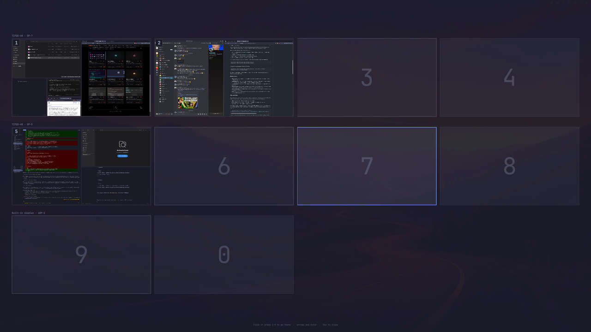

# Workspaces

Pin Hyprland workspaces to monitors, and have each monitor's bar show only its
own. An overview shows every workspace at once, with live window thumbnails.


- **Plugin ID:** `io.github.kimm-stensborg.workspaces`
- **Kinds:** `bar-widget`, `overlay`, `service`
- **License:** MIT
- **Requires:** Omarchy 4 (Quattro) with `omarchy-shell`, Hyprland with Lua config

## Install

```bash
omarchy plugin add https://github.com/kimm-stensborg/omarchy-workspaces.git
omarchy plugin enable io.github.kimm-stensborg.workspaces --section left
```

That is the whole setup. On first start it spreads 1–10 across your monitors,
writes `~/.config/hypr/workspaces.lua`, and binds the overview to `SUPER` + the
key left of `1`.

To replace the stock widget:

```bash
omarchy plugin enable io.github.kimm-stensborg.workspaces --before omarchy.workspaces
omarchy plugin disable omarchy.workspaces
```

## Update

```bash
omarchy plugin update io.github.kimm-stensborg.workspaces
omarchy-restart-shell
```

## Remove

```bash
omarchy plugin remove io.github.kimm-stensborg.workspaces
rm ~/.config/hypr/workspaces.lua ~/.config/omarchy/workspaces.json
```

Then drop the `hypr.workspaces` line from `hyprland.lua` and the overview
shortcut from `bindings.lua`.

## What it does

- **Each workspace has a home monitor.** `SUPER+7` takes you to 7's monitor.
- **Each bar shows its own workspaces**, even empty ones, so nothing moves.
- **Identical monitors keep their workspaces**, matched by serial, even when
  `DP-5` and `DP-7` swap.
- **Undocking moves workspaces** to the nearest monitor, and back on return.

## The overview



Open it with **󰖳** in the bar or **`SUPER` + the key left of `1`**.

| Key | Action |
|-----|--------|
| `1`–`9`, `0` / click | go to that workspace |
| arrows / `h` `j` `k` `l` | move the selection |
| `Enter` | go to the selection |
| `Esc` | close |

## The setup panel

```bash
omarchy-shell shell summon io.github.kimm-stensborg.workspaces '{}'
```

**Drag** a workspace to another monitor. **Click** one, or press its number,
to switch it off: no rule, no keybinding. **Identify** labels each physical
screen. Nothing is written until **Apply**.

## CLI

```bash
ln -s ~/.config/omarchy/plugins/io.github.kimm-stensborg.workspaces/bin/omarchy-workspaces ~/.local/bin/
```

| Command | What |
|---------|------|
| `doctor` | check Hyprland against the config |
| `status` | where each workspace is now |
| `assign DP-7 1-4` | assign workspaces to a monitor |
| `disable 4,10` / `enable 4` | switch workspaces off and on |
| `apply` | regenerate the rules and reload |
| `open` / `overview` | the setup panel / the overview |

## Config

`~/.config/omarchy/workspaces.json`, applied on save:

```json
{
  "version": 1,
  "count": 10,
  "monitors": {
    "desc:Lenovo Group Limited T27QD-40 VNACDZ5V": [1, 2, 3, 4],
    "desc:Lenovo Group Limited T27QD-40 VNACDZ1G": [5, 6, 7, 8],
    "eDP-1": [9, 10]
  },
  "disabled": []
}
```

Monitors go left to right. `count` is how many workspaces you use; `disabled`
lists the ones that are off.

## Tests

```bash
./test.sh
omarchy plugin validate .
```
